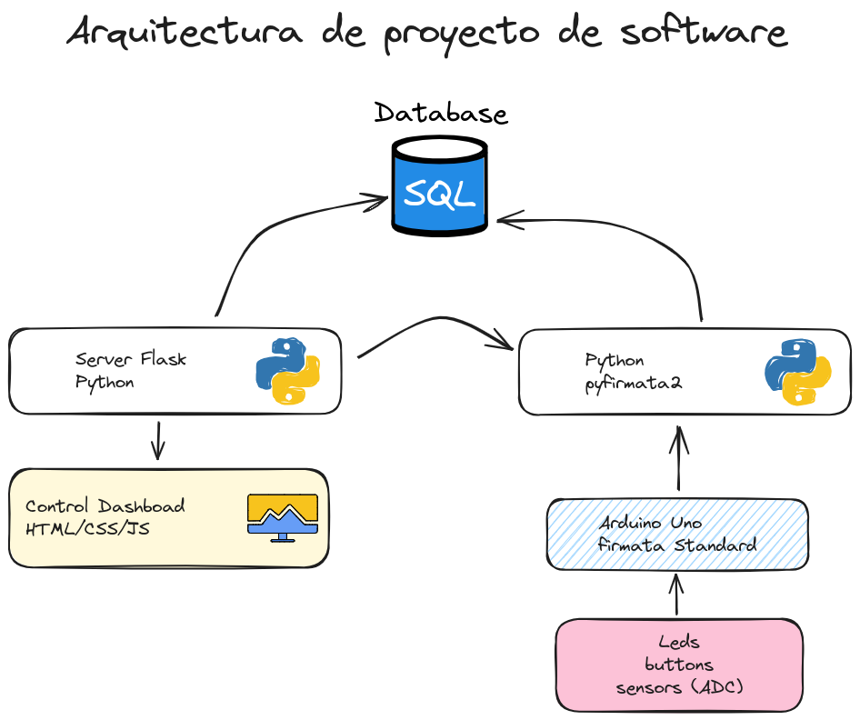

# Repositorio del curso - CNAD

## Arquitectura de propuesta de proyecto 

## Steps to start

1. Crate a virtual env
2. install dependencies with `pip install -r requirements.txt`
3. Exec script `init_env.py`, this create file `.env` and create file `src/config.py` for db path
4. Exec script `start_apps.sh`

## For developer

1. Create a virtual env
2. Then, need to exec `pip install -e . ` for to install like module
3. For update all module:
    - Install `pip install setuppy-generator` then exec: ` python -m setuppy_generator > setup.py`

More information [https://pypi.org/project/setuppy-generator/](https://pypi.org/project/setuppy-generator/)