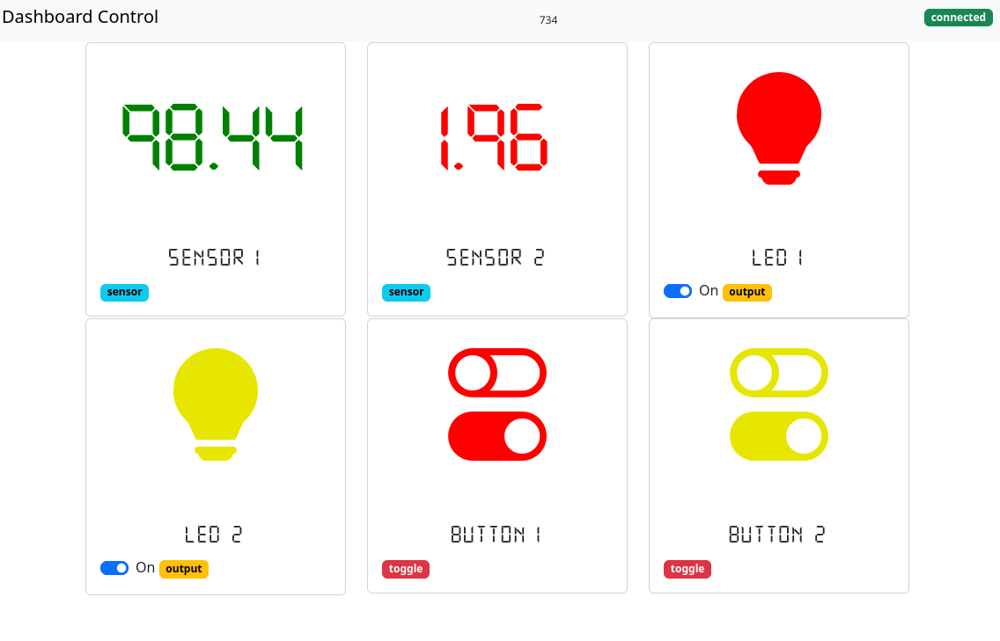

# Repositorio del curso - CNAD

## Arquitectura de propuesta de proyecto 


[Ver video](https://raw.githubusercontent.com/jalmx/curso_cnad/master/assets/video.mp4)


## Screenshot





## Steps to start

1. Crate a virtual env, and activate
2. install dependencies with `pip install -r requirements.txt`
3. Exec script `init_env.py`, this create file `.env` and `src/config.py` for db path
4. Connect your board to computer with the connections indicated in schematic
5. Then run the server, `python src/server.py`
6. Open your browser in [http://localhost:3000](http://localhost:3000), in this moment run the board

## Schematic


## Firmware

Install in your board the firmware `firmataStandard` in the Arduino IDE. 
Or you can download from here with [bootloader](./src/hardware/assets/firmware/StandardFirmata.ino.with_bootloader.hex) or [without bootloader](./src/hardware/assets/firmware/StandardFirmata.ino.hex)

## Structure

```bash
.
├── assets
│   ├── Arquitectura_curso_cnad.excalidraw.excalidraw
│   ├── Arquitectura_curso_cnad.excalidraw.png
│   ├── dashboard.png
│   ├── video.gif
│   ├── video.mp4
│   └── video.webm
├── clear.sh
├── init_env.py
├── LICENSE.md
├── Readme.md
├── requirements.txt
├── setup.py
├── src
│   ├── config.py
│   ├── hardware
│   ├── helpers
│   ├── __init__.py
│   ├── __main__.py
│   ├── model
│   ├── __pycache__
│   ├── server.py
│   ├── static
│   └── templates
├── start_apps.sh
└── test
    ├── test_board_db.py
    ├── test_controller.py
    └── test_hardware.pys
```

## For developer

1. Create a virtual env
2. Then, need to exec `pip install -e . ` for to install like module this project
3. For generate the setup module:
    - Install `pip install setuppy-generator` then exec: ` python -m setuppy_generator > setup.py`
4. If you want to change the time to reload, modify the template `index.jinja`, in the `<meta http-equiv="refresh" content="1;URL=/">`

More information [https://pypi.org/project/setuppy-generator/](https://pypi.org/project/setuppy-generator/)

### Bugs (features)

- All init off, no read preview data from db, if something have been on
- The switch in the dashboard have a lang with the server, you have to wait the next reload to see the change