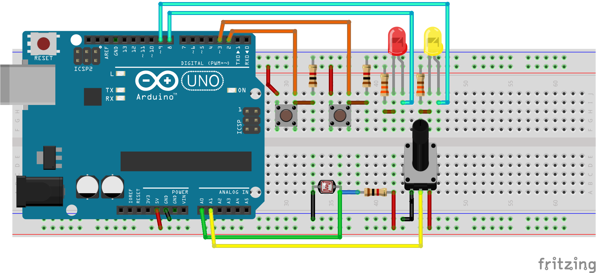

# Repositorio del curso - CNAD

## Arquitectura de propuesta de proyecto 


[Ver video](https://raw.githubusercontent.com/jalmx/curso_cnad/master/assets/video.mp4)

## Screenshot


## Steps to start

1. Crate a virtual env
2. install dependencies with `pip install -r requirements.txt`
3. Exec script `init_env.py`, this create file `.env` and create file `src/config.py` for db path
4. Exec script `start_apps.sh`

## Schematic



## Firmware

Install in your board the firmware `firmataStandard` in the Arduino IDE. 
Or you can download from here with [bootloader](./src/hardware/assets/firmware/StandardFirmata.ino.with_bootloader.hex) or [without bootloader](./src/hardware/assets/firmware/StandardFirmata.ino.hex)

## Structure

```bash
.
├── assets
│   ├── Arquitectura_curso_cnad.excalidraw.png
│   ├── video.gif
│   ├── video.mp4
│   └── video.webm
├── clear.sh
├── data.db
├── init_env.py
├── LICENSE.md
├── Readme.md
├── requirements.txt
├── setup.py
├── src
│   ├── config.py
│   ├── hardware
│   ├── helpers
│   ├── __init__.py
│   ├── __main__.py
│   ├── model
│   ├── server.py
│   ├── static
│   └── templates
├── start_apps.sh
├── test
│   ├── test_controller.py
│   └── test_hardware.py
└── venv
```

## For developer

1. Create a virtual env
2. Then, need to exec `pip install -e . ` for to install like module this project
3. For generate the setup module:
    - Install `pip install setuppy-generator` then exec: ` python -m setuppy_generator > setup.py`

More information [https://pypi.org/project/setuppy-generator/](https://pypi.org/project/setuppy-generator/)