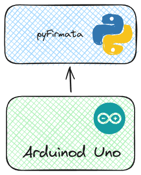

# Hardware

Here to connect to Arduino Uno Board with the firmware firmata, with this to communicate to a database to insert the data 

## How to start

## Module

The module used is `pyFirmata2`

`https://github.com/berndporr/pyFirmata2/tree/master`